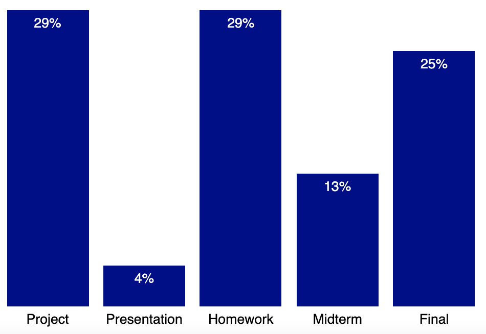

## Homework Assignment 1A

Version History: 

- Released, 2021/8/21

Due Thursday August 26, 11:59 PM

In this assignment we are:

- Demonstrating the assignment workflow for CSC 544
- Considering visualizations we have seen "in the wild"
- Practicing using basic web technologies for visualization

The artifacts generated should be presented in the HTML pages or LaTeX
documents as described below. No style information should be in the HTML tags
unless explicitly allowed. Do not use HTML tags like `
`, `<b>`, or
`<i>` to alter visual appearance. See Mozilla Developer Network for tag
descriptions to ensure you are not mis-using a tag for presentation against
its set content. Programmatically added SVG elements may have style
attributes.

You will be graded on what is in your github classroom repository associated
with the assignment at the time of the due date. Do NOT include files specific
to your system not required for the assignment (e.g., `.DS_Store` on macos) or
LaTeX compilation files (e.g. `reading.pdf` or `reading.aux`). Include only
the files required for grading or included with the assignment code.

### Survey & Visualization Example. (20 pts  -- The other 80 are in HA1B) 

Use the following link to create your github repository for this part of the
assignment: [https://classroom.github.com/a/1b5jc-il](https://classroom.github.com/a/1b5jc-il).

Use the templates provided with your Github Classroom repository. Turn in the
modified `HA1A.html` and `HA1A.css` files, as well as the image for the
visualization you chose.

(The base files can also be directly accessed at:
[https://github.com/uacsc544fall2021/ha1a-base](https://github.com/uacsc544fall2021/ha1a-base).)

Replace the name in the title with your name.

**A visualization you like**: Under the `div` of class `visualization`,
include an image of a visualization you like and explain what it is and why
you chose it (why you like it). I may share these images with the class. Do
not include something you would feel uncomfortable sharing. If you are okay
with sharing but do not want your name attached, please leave a note and I
won't associate your name with the contributed visualization. 

**Questionnaire about you**: Fill out the questionnaire directly in the HTML
under the `div` of class `questionnaire.` 

**Simple HTML/CSS visualization**: Under the `div` of class `percentages`,
create a vertical bar chart that shows the grade distribution in this
class. 

Do not use any javascript libraries. Do not use an SVG or any SVG elements. In
this div, you may include style attributions directly in the HTML tags if you
prefer. You may also change existing CSS rules and/or add new CSS rules,
though please keep the appearance of the visualization and questionnaire
portions.

The key elements of the bar chart are:

- it is a vertical bar chart rising from the bottom
- the bars encode the relative percentage values accurately
- there are labels within the bars spaced and colored so they are readable
  (e.g., no tiny fonts, no dark text on dark background)
- there are labels beneath the bars indicating what each bar means
- the values match those in the syllabus

Here is an example **with incorrect values**:

You may choose different details in terms of spacing, colors, bar width,
absolute height as long as proportions are maintained, etc. as long as the key
elements listed above are maintained.

In the above example, the width of the bars is 80 pixels and each percent maps
to 10 pixels. The bar color is dark blue. The fonts are 10 pt sans-serif.

