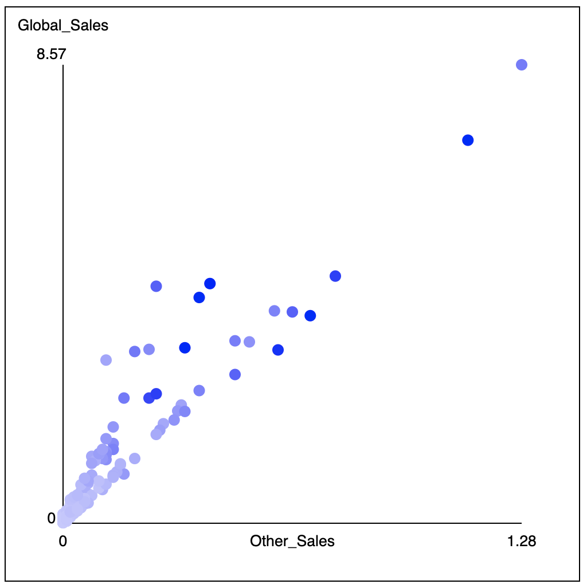

## Homework Assignment 1B

Version History: 

- 2021/8/29, `data.js` --> `dataF2021.js`
- 2021/8/25, add more citation info to D3 paper
- Released, 2021/8/21

Due Thursday September 2, 11:59 PM 

In this assignment we are:

- Practicing using basic web technologies for visualization
- Compiling LaTeX generated from templates
- Practicing a careful reading of a research paper

The artifacts generated should be presented in the HTML pages or LaTeX
documents as described below. No style information should be in the HTML tags
unless explicitly allowed. Do not use HTML tags like `
`, `<b>`, or
`<i>` to alter visual appearance. See Mozilla Developer Network for tag
descriptions to ensure you are not mis-using a tag for presentation against
its set content. Programmatically added SVG elements may have style
attributes.

You will be graded on what is in your github classroom repository associated
with the assignment at the time of the due date. Do NOT include files specific
to your system not required for the assignment (e.g., `.DS_Store` on macos) or
LaTeX compilation files (e.g. `reading.pdf` or `reading.aux`). Include only
the files required for grading or included with the assignment code.

Use the following link to create your github repository for this part of the
assignment: [https://classroom.github.com/a/mwrm_fw6](https://classroom.github.com/a/mwrm_fw6)

The base files can also be accessed at: [https://github.com/uacsc544fall2021/ha1b-base](https://github.com/uacsc544fall2021/ha1b-base).

#### Paper Reading & LaTeX (20 pts)

Read the paper "D3: Data-Driven Documents" by Bostock, Ogievetsky, & Heer, IEEE TVCG 2011. Answer the following
questions:

1. What problem is this paper trying to solve?

2. Why is this problem considered a visualization problem?

3. Why is the problem important?

4. How does this paper contribute to solving the problem? 

5. What approaches are used to construct the contributions?

6. How are the contributions of the paper evaluated, justified, or validated? 

7. What do you think are this paper's strengths? 

8. What do you think could be improved about this paper?

9. What future directions do the authors suggest? 

10. What future directions not mentioned in the paper would you suggest?

11. What questions remain regarding this paper? For example: Were these things
   you find difficult to understand? Are there details left unanswered? Do you
have philosophical questions regarding some of the points made?

12. How might the concepts or approaches in this paper relate to your course
   project? If you have not yet chosen a course project, give your best guess
with what you are thinking of doing now.

Note: These questions have been adapted from similar guides and assignments by
William G. Griswold, Premkumar Devanbu, and Michelle Strout.

The results should be submitted as a LaTeX `.tex` file that will compile into
a `.pdf` when the insturctor issues the command `pdflatex reading.tex` at the
command line. A template is available in the github classroom directory as
`reading.tex`. If you use another LaTeX editor, please ensure the file still
compiles with `pdflatex` at the console. Some editors are more forgiving of
LaTeX errors than others and some may suppress error messages.

This portion will be graded on whether you have answered all the questions,
including sub-questions, the thoughtfulness of your answers, and the
readability of your answers.

#### Visualization with SVGs (20 pts for bar chart, 40 pts for scatter charts)

For this assignment, do not use any external JS libraries (e.g., d3js or
others). 

Your repository should be pre-loaded with `ha1b.html`, `ha1b.css`, `ha1b.js`,
and `dataF2021.js`.  You will modify `ha1b.js` and `ha1b.css` in this assignment.
Do not change the height and width of the SVGs.

After writing the code described below, the code in the `load` event listener
should run when `ha1b.html` is loaded and create the described charts. 

**Bar Chart**: Modify the function `createBarChart` to draw a bar chart in the
input SVG element. Leave an at least 5 pixel margin within the SVG (bars and
text should not run into the border). The bars should start low enough such
that the bars and the labels fit within the SVG. 

The bar chart should come out similar to the one in HA1A with dark blue bars
that are 80 pixels wide and `10 x data` pixels high. The fonts should be 10
point sans-serif and there should be 5 pixels of margin to the top of each
one.

The dataset is provided in `data.js` as `grade_percents`.

**Scatterplots:** Modify the function `createScatter` to draw scatter plots in
the given SVGs.  Leave a 50 pixel margin within the SVG. In other words, the
point `(0, 0)` in the data should appear at the SVG coordinate `(50, 450)`
(lower left corner). 

Draw axes, their property label, and their low and high values. The labels
need not be pixel-perfect to the sample, but should be completely visible and
not occlude the data or axes.

The data should span the space within the margins. For example, even if the
data only goes from 0 to 100, it should be scaled to fit across 400 pixels.
Assume the low range is zero. (It is not.)

The scatterplot mark should be circles of radius between 5`.  

The color of the scatter plot marks should be blue gradients where the red and
green values are equal to each other vary between `0` and `200` and darker
equals a higher value. 

There should be an `svg:title` element associated with each circle. You may
want to look up title elements on the Mozilla Developer Network. The result
should be that on some browsers hovering over the circle will cause the text
to appear. The value of the title should be the item's `Name` value
followed by a pipe between spaces (` | `) and then its `Platform` value. If the `Name` is
`Pac-Man` and the `Platform` is `Atari 2600`, the title value should be
`Pac-Man | Atari 2600`.

*Note: This data is for console games from 2015, collected at the end of 2016,
so it will not contain `Pac-Man | Atari 2600`. This data was taken from Kaggle
and has been filtered to only include games with values in all columns. I
cannot guarantee its veracity. I am not familiar with most games.*

In the starter code, the `createScatter` function is applied to the last three
SVGs using the `drinks` dataset from `dataF2021.js`

Here is an example of a chart (with different options than in the `ha1b.js` code):

These plots will be evaluated for correctness, completeness, and adherence to
specifications.

