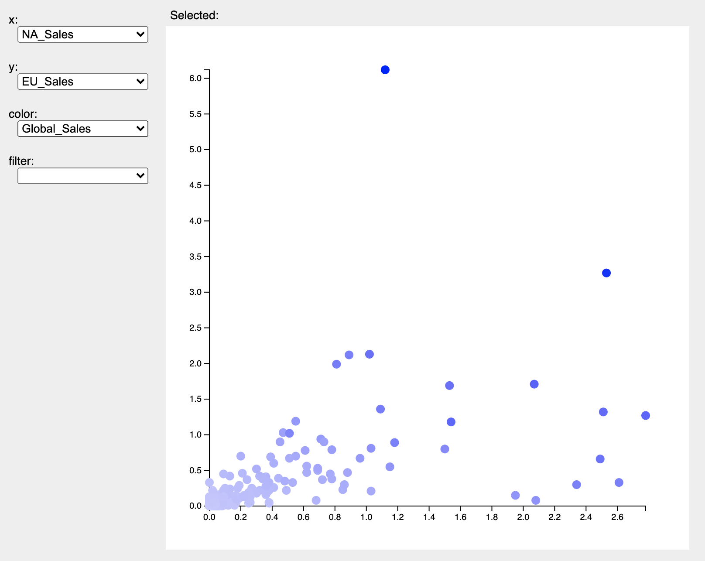

## Homework Assignment 2

Version History: 

- 2021-09-16, fix typo in scatter plot points
- 2021-09-07, fix typo in movie link
- Released, 2021-09-06

Due Thursday September 16, 11:59PM

In this assignment we are:

- Practicing using the d3js library for visualization
- Practicing organizing and handling UI events 
- Gaining familiarity reading and interpreting a design study
- Reinforcing class topics with short answer questions

The artifacts generated should be presented in the HTML pages or LaTeX
documents as described below. No style information should be in the HTML tags
unless explicitly allowed. Do not use HTML tags like `
`, `<b>`, or
`<i>` to alter visual appearance.  Programmatically added SVG elements may
have style attributes.

Github Classroom Assignment link: [https://classroom.github.com/a/12mZIO9e](https://classroom.github.com/a/12mZIO9e).

Anything you want graded should be in the repository at the due date in the
`master` (default) branch. Do not forget to `git commit` and `git push` to
`github.com`. You may want to verify through the web client or cloning to
another place to ensure your commits have been made.

### Paper Reading (20 pts)

Read the paper "PAVED: Pareto Front Visualization for Engineering Design" by
Lena Cibulski et al. (Computer Graphics Forum/EuroVis 2020) and answer the
following questions. These are the same questions from your previous paper
reading assignment. 

1. What problem is this paper trying to solve?

2. Why is this problem considered a visualization problem?

3. Why is the problem important?

4. How does this paper contribute to solving the problem? 

5. What approaches are used to construct the contributions?

6. How are the contributions of the paper evaluated, justified, or validated? 

7. What do you think are this paper's strengths? 

8. What do you think could be improved about this paper?

9. What future directions do the authors suggest? 

10. What future directions not mentioned in the paper would you suggest?

11. What questions remain regarding this paper? For example: Were these things
   you find difficult to understand? Are there details left unanswered? Do you
have philosophical questions regarding some of the points made?

12. How might the concepts or approaches in this paper relate to your course
   project? If you have not yet chosen a course project, give your best guess
with what you are thinking of doing now.

Note: These questions have been adapted from similar guides and assignments by
William G.  Griswold, Premkumar Devanbu, and Michelle Strout.

The results should be submitted as a LaTeX `.tex` file that will compile into
a `.pdf` with the command `pdflatex`. You may use the template from HA1B or
create your own as long as it is easy for me to read and pick out the
individual questions. The name of the `.tex` file should be `reading.tex.` 

This portion will be graded on whether you have answered all the questions,
including sub-questions, the thoughtfulness of your answers, and the
readability of your answers.

### Short Answer (10 pts as divided below)

Create a file called `short.tex` and answer the following questions. Like
`reading.tex` above, it should compile into a `.pdf` with the command
`pdflatex.` 

1. Above is Charles Minard's map of Napoleon's Russian Campaign. Explain the
   marks, channels, and encoding rules of the black/tan part of this
visualization (in other words, not including text, annotations/grid lines,
river lines, or temperature chart). This image was taken from
[https://en.wikipedia.org/wiki/File:Minard.png](Wikipedia). (8 pts)

2. Explain two benefits of data abstractions. (2 pts) 

### Visualization with d3js (70 pts as divided below) 

The directory  is pre-populated with  `HA2.html`, `HA2.css`, `HA2.js`, and
`dataF2021.js`. Modify `HA2.html` to put your name in the title. You will modify
`HA2.js` and `HA2.css` in this assignment to implement the below. Do not
change the height and width of the SVGs or modify the relative layout/design
of the included components. 

Use the d3js **version 6** library **and no other**. For the SVGs, do not use
calls to `createElementNS` or `getElementById` etc. Instead use D3js. For
non-SVGs, you do not need to use d3js, only for the SVGs.

**Note:** d3js version 6 has different scale functions than d3js version 3.
There are a lot of version 3 examples still online. Be sure you're using the
functions here: [https://github.com/d3/d3-scale](https://github.com/d3/d3-scale). 

d3js version 6 has different event handling than event d3js version 5. You may
want to check out the migration guide here:
[https://observablehq.com/@d3/d3v6-migration-guide](https://observablehq.com/@d3/d3v6-migration-guide)
for examples that describe the change versus other examples you may find
online.

While in the previous assignment, you had to calculate the scaling factors on
your own, for scaling in this assignment, you must use the d3js scale
functions (e.g., `d3.scaleLinear()`).

Do not use other libraries with the exception that you may use a library to
implement MVC or any other design pattern for managing multiple views
*provided it does not require anything but loading the page in a browser to
run.* I **will not** launch a server, `npm install` anything, run Node, or
similar to grade this assignment. You should only use the calls in that library
to implement the UI architecture, not other functionality.

Do not use `innerHTML`. The intention of this assignment is to continue to use
JS for the visualization. You may alter `HA2.html` manually to populate the
dropdown elements or make other notes if you wish, but it is not expected of the
assignment. My solution propulates the dropdowns using JS.

The margins within the SVGs should allow all elements to appear without being
clipped off the side. I used 50 pixels on all sides for the scatter plot
points, leaving ample room for entire circles to draw and for the axes tick
marks to show.

#### Bar Chart (15 pts)

Recreate the bar chart showing the grade distribution (yes, a third time!).
This time do it with d3js.  Populate the function `createBarChart` to perform
this operation such that the call to it in `window.addEventListener` works.

#### Scatter Plot (55 pts)

Implement an interactive scatter chart as shown in the movie linked here:
[images/HA2-Sample-Movie.mov](images/HA2-Sample-Movie.mov)

Add code to the `window.addEventListener` so that the scatter chart works on
page load. It is highly recommended that you create some functions outside the
anonymous `window.addEventListener` callback to keep things readable. 

In my solution, I made separate functions to create a visualization state
object, populate and wire the dropdowns, handle the "Selected" label, and
handle the scatter chart itself. 

Like in HA1B, the scatter chart encodes three attributes of the Video Game
Sales dataset from Kaggle. The following enhancements have been made:

- rather than using `svg:title`, hovering over a point updates the contents of
  the HTML element `selected-label` and adds a 3 pixel goldenrod outline to
the circle in the SVG.

- the encoding rule for each channel can be changed via drop down (tag name:
  `select`) value. The options include all numeric properties **except**
`Year_Of_Release`. The initial ones should be `NA_Sales` in x, `EU_Sales` in
y, and `Global_Sales` in color. 

- the data points can be filtered by platform console. The initial setting
  should be no filter.

- points that appear "grow" into existence, points that disappear "shrink" out
  of existence.

- when the points move due to the encoding changing, the axes and points
  appear to animate over 750ms. Note calls to d3-scale and d3-axis will do
this in a few lines of code, including automatic tick marks and labeling. You
do not need to draw/animate the axes using graphical primitives.

- the plot range should now equal the data range instead of starting from zero

I recommend building this in stages. Here's one such plan that includes
building a visualizatio state object to keep track of state. You do not have
to use on, but it can make debugging easier. You could also follow this plan
without introducing a separate object. You do not have to follow this order.
Develop in the way more comfortable to you:

1. Build a mostly-static scatter plot view and test that it works for static
   initializations of  `x`, `y`, and `color`. 

2. Create a visualization state object assuming a static view with no
   filtering or hovering or encoding rule changes. It can hold values such as
the data, selected points, and selected axes. Create methods to get these
values, e.g. `getXProperty` or `getData`. Modify your scatter view to call
these methods.

3. Add in the ability to hover over a point and get the label. This requires
   updating the visualization state with functions to get and set the selected
point and then updating the scatter plot view to and `selected-point` view to
use these functions and update accordingly. Test liberally.

4. Add functionality for a single drop down. Update the visualization state with
   methods to set the drop down value and calls to redraw the scatterplot when
it does. First test the drop down, then wire it to the rest of the system.
Don't worry about the transition animations yet.

5. Finish the drop downs.

6. Add the animations. (d3js transitions)

There are other orders in which you could complete this assignment. For
example, if you want to do the d3js later, you could work on the visualization
state and dropdowns, testing that everything is 'wired' correctly with
`console.log` statements.

##### Grading

Here is a breakdown of grading by functionality. Partially credit may be
assigned for partial completion.

- Scatter chat dots appear in correct place using d3js: 5 pts
- Hovering on a circle outlines the circle and updates the text above the SVG: 10 pts
- Drop downs are appropriately populated: 5 pts
- Changing the x, y, or color drop down updates the scatter plot correctly: 10 pts
- Changing the filter drop down updates the scatter plot correctly: 10 pts
- D3js scales and axes are used and animate correctly: 10 pts
- Point/circle animations (changing position, growing and shrinking in radius)
  animate correctly: 5pts

You may embellish as you like (e.g., adding a color bar, more controls if you
like this dataset as long as they can be turned off) as long as it doesn't get
in the way of the graded elements.

##### Screenshot

