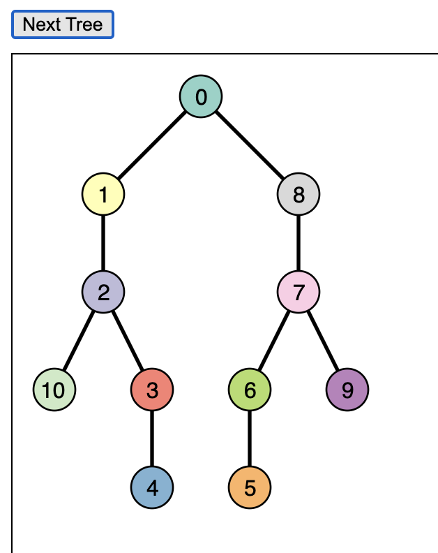

## Homework Assignment 4

Version History: 

- 2021/11/04 - Add clarification on `trees.js` from Piazza
- Released, 2021/10/21

Due Thursday Nov 4, 11:59PM

In this assignment we are:

- Demonstrating the Reingold-Tilford Tidy Tree layout for binary trees.
- Practicing using the d3js library for interactive visualization
- Gaining familiarity reading and interpreting a technique contribution

The artifacts generated should be presented in the HTML pages or LaTeX
documents as described below. No style information should be in the HTML tags
unless explicitly allowed. Do not use HTML tags like `
`, `<b>`, or
`<i>` to alter visual appearance.  Programmatically added SVG elements may
have style attributes.

Submit your assignment through Github Classroom: [https://classroom.github.com/a/DGAQu3i0](https://classroom.github.com/a/DGAQu3i0)

### Paper Reading (20 pts)

Read the paper "SplitStreams: A Visual Metaphor for Evolving Hierarchies" by
Fabian Bolte, Mahsan Nourani, Eric D. Ragan, and Stefan Bruckner. Answer the
following questions which are the same as in the previous assignments.

1. What problem is this paper trying to solve?

2. Why is this problem considered a visualization problem?

3. Why is the problem important?

4. How does this paper contribute to solving the problem? 

5. What approaches are used to construct the contributions?

6. How are the contributions of the paper evaluated or justified? 

7. What do you think are this paper's strengths? 

8. What do you think could be improved about this paper?

9. What future directions do the authors suggest? 

10. What future directions not mentioned in the paper would you suggest?

11. What questions do you have about this paper? For example: Were these things
   you find difficult to understand? Are there details left unanswered? Do you
have philosophical questions regarding some of the points made?

12. How might the concepts or approaches in this paper relate to your course
   project? If you have not yet chosen a course project, give your best guess
with what you are thinking of doing now.

Note: These questions have been adapted from similar guides and assignments by
William G.  Griswold, Premkumar Devanbu, and Michelle Strout.

The results should be submitted as a LaTeX `.tex` file that will compile into
a `.pdf` with the command `pdflatex`. Use the template from the previous
assignment. The name of the `.tex` file should be `reading.tex.`

This portion will be graded on whether you have answered all the questions,
including sub-questions, the thoughtfulness of your answers, and the
readability of your answers.

### Short Answer (16 pts)

For both of the IEEE Visualization your-choice full paper presentations (not
the best paper session) you attended, explain the following:

  a. Why did you choose this presentation? (Answer should explain how it is
related to your project and any additional motivations.)

  b. What problem is this presentation addressing?

  c. What are the contributions towards addressing this problem?

  d. In what ways does the presented research related to concepts we have
discussed in class?

### Visualization with d3js (64 pts)

For this assignment, you will code your own Reingold Tilford Tidy Tree Layout
and corresponding visualization in Javascript with d3js. Use the d3js version
7 library and no other. Do not use the tree layout built into d3js.

You are given `HA4.html`, `HA4.css`, `HA4.js`, and `trees.js`.  Modify
`HA4.html` so the title contains your name. Do not change `HA4.css.`

You will modify `HA4.js` for this assignment. Do not remove existing code from
`HA4.js`. 

The view will display the tree as described below. Note the view will call an
external function, calculateRTLayout, to find the tree layout coordinates.

Clicking on the button will cause the next tree to appear. When the end of the
array of trees is reached, the data should loop back around.

The finished visualization should look as below. A movie is available at
[HA4.mov](images/HA4.mov).

#### Data

In `trees.js` there is a single array of JSON objects called `tests`. Each
object in `tests` has a member called `nodes` which is an array of objects
that each contains and `id` as well as the `id` of its `left` and `right`
child (which may be `null`). The value of `id` matches the objects position in
the array. These values describe a binary tree. 

**The purpose of `trees.js` is to describe the data format, not to cover all
test cases. The grading dataset will contain trees in addition to what is in `trees.js`.**

#### calculateRTLayout

You will alter these tree objects by adding code to the functions in `HA4.js`.
Specifically, he code should add `x` and `y` values to the nodes using the
Reingold Tilford Tidy Tree Layout as discussed in class.  You may also refer
to the original paper
[http://reingold.co/tidier-drawings.pdf](http://reingold.co/tidier-drawings.pdf).

Note: in my solution, none of the functions internal to calculateRTLayout are
more than 15 lines of code. If yours is getting long, there may be a problem.

Rather than using the spare left and right pointers to describe the contours,
this version creates explicit `left_contour` and `right_contour` members of
each node to hold the `id`s of the left and right contours at the next depth.
These need not be updated for internal nodes.

#### drawTree

The drawTree function should hold the d3js code to draw the tree after the
layout has been calculated. Use the general update pattern. You may use
additional functions to drawTree, but the data joins and general update
pattern should exist in that function.

- Node, link, and label styles match those set in `HA4-css.`

- The vertical and horizontal separation used in the layout is 70.

- Each node should be labeled with its `node.id` parameter as shown in the
movie. The labels should always appear on top of the nodes.

- The nodes should always appear on top of the links.

- The nodes are colored with the d3js Set3 scheme.

- The entire graph should have a 30 pixel margin from the top and left edges of
the SVG.

- The following animations should occur over 750ms. (See the .mov file for an
example):

  - Entering nodes, links, and labels should appear from the upper left.

  - Exiting nodes, links, and labels should disappear through the lower right.

  - Updating nodes and their labels should have animated movement between positions

  - Updating links should have animated movement between positions. In the
    example there is no set identity to the links, but you can set one (e.g.,
left or right child of a certain id.) However, you may not delete all links
each time, some should be re-used and animate.

#### Grading

This is the rough breakdown of points. This breakdown assumes the general
update patttern is adhered to. Points may not be earned if they violate the
pattern.

- RT Layout is calculated correctly according to algorithm: 40 pts
  -  Five points will be deducted for each class of cases where the layout is
     incorrect (e.g., different classes of offset miscalculations)
- Tree changes on click: 3 pts
- Nodes:
  - Correct placement: 1pts
  - Correct styles: 3 pts
  - Correct transitions: 2pts 
- Links:
  - Correct placement: 2pts
  - Correct styles: 1 pts
  - Correct transitions: 2pts
- Labels:
  - Correct placement: 2pts
  - Correct styles: 1 pts
  - Correct transitions: 2pts
- Correct Layering across all elements and transitions: 5 pts

If you are unable to get your layout to work, include another file
`hand-drawn-trees.js` with an array called `mytrees` that have the x and y
values filled in already to demonstrate your d3js code and your ability to
calculate the layout coordinates by hand. Include comments with your code
describing the logic behind your implementation of each function. In this case
partial credit may be awarded for parts of the layout algoritm you did
complete, assuming it is well-commented and the by-hand values are are
correct.

